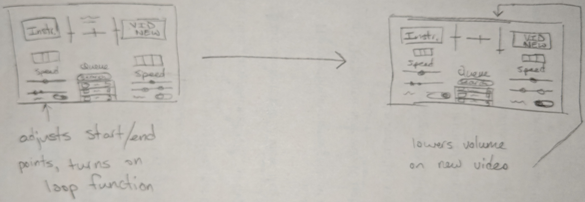

# [P1](index) | [P2](p2) | [P3](p3)

## Interaction Scenarios
### Problem 1 -- DJ Controlling the Music
- Brittany is hosting a party for her friend’s 21st birthday.  To celebrate, she decides to DJ for the night instead of simply putting on a playlist like they usually do, but wants her friends to be able to help select songs throughout the party.
- She hooks her laptop up to her speakers as she gets ready to start playing music from her new playlist.
- As people start to arrive, one friend joins Brittany’s online room using her room code, searches for a song, and clicks the “suggest” button on her desired song. Others who are also in the room see this and upvote the song in agreement. Brittany then considers the suggestion by comparing it to what is currently playing.
- Brittany decides to put the suggested song on next, but wants to make the two transition better, so she starts off by playing the suggested song at a faster pace to match the BPM of the current song.
- Brittany then fades in the new song as the current one ends, and eventually returns the track’s speed back to normal.
- As the suggested song plays, Brittany decides to mix in bits of an instrumental she found online that she thought would play nicely with the suggested song.
- To get the right part of the instrumental, she sets a start and end point on the track and turns on the “loop” function to continuously play that segment of the song.
- Brittany turns the volume down on the suggested song in order to make an announcement to her friends.

### Problem 2 -- Partygoer Voting on Existing Songs
- It’s Friday night, and Dan is attending a party with his friends celebrating the Huskies’ win at the Beanpot earlier that evening.
- The rest of his group notices that they are able to suggest songs to the DJ, and they decide to add several songs to the queue from an album they all enjoy.
- Dan, however, only likes one song from the list of suggestions, and would prefer not to hear the others that have been listed.
- Dan notices that no one else has voted on these songs, and decides to upvote the song that he does like, and downvote the others that his friends added.  This re-orders the queue and he is happy that his preferences are accounted for.
- The song Dan upvoted then gets selected by the DJ, and gets played next.

### Problem 3 -- Partygoer Searching for New Songs

- Clarissa goes to a party at her friend Adam’s house.  They both like the same type of music.
- Upon arriving, she finds out that Adam is DJing the party that night and is playing many of her favorite songs.
- During one of the songs, Clarissa realizes that a new song that her favorite artist just released would pair nicely with the current song, as they have similar BPMs and have many similar characteristics.
- Clarissa decides to search for and suggest that song to the group
- The search doesn’t return what she expects, so she uses a different search query.
- Clarissia adds the song to the queue. 
- Other partygoers also seem to want to hear this song, and it gets upvoted to the top of the queue.
- Adam notices it, then decides to play it next after the current song ends.

## Design Options
### Option 1
Columns: This was the design we ended up going with, because it aligned everything very cleanly into columns, and the vertical queue representation helps to convey prioritization. There is still plenty of space for all the controls we’d need to implement as well.

### Option 2
Videos not visible: The benefits of this are a larger sandbox to include the DJ’s mixing buttons, and removing the actual video feed itself as the visual content can be distracting. However, a lot of the screen real estate is unused and the horizontal queue may be unclear to some users. Also, the affordance of having the imagery of a record may be seen as being able to “scratch” the records like a real DJ, although we don’t plan on implementing scratching.

### Option 3
Hideable queue: This design features the queue in a minimizable window, which would be good if screen resolution was lower and we needed to fit more components on the screen. It also has clearer time controls, as seen on the two timelines below the videos. We decided not to go with this because it doesn’t make a whole lot of sense to hide the queue at any point, and having the controls as compacted as they are may be too dense for the beginning user. 

## Overall Design
### Splash Page:
Serves as a landing page for all users, where they can log in as either a host or a partygoer.  If they’re a partygoer, they’ll have to provide the ID of the party they would like to join. On the mobile view, we don’t show the Host button since it is unlikely they will be DJing from the smaller mobile interface.

### Dashboard / Host:
As the DJ, this user will need to have easy access the musical elements of the app. In this view, the user can see which two songs are loaded up, the mixing elements (e.g. loop toggles, faders, playback speed and sample start/end times), and the prioritized queue provided by the partygoers. The room code is also visible at the top.

### Dashboard / Partygoer / Desktop:
Although this view will likely be seldom used, it is important to at least design with it in mind. As one of the partygoers, this user is mainly concerned with voting on songs in the queue and adding new songs to the queue.  In this view, the user can see which songs are in the prioritized queue - with buttons allowing them to vote - along with an interface for them to search a library of songs and suggest them.

### Dashboard / Partygoer / Mobile / Vote:
In the mobile view, voting and search get broken out into two separate pages accessible by a menu. The functionality remains the same, but this improves visibility. When the user clicks the search bar, it opens up the search view. On these screen you can also see the queue and use the upvote/downvote buttons to provide input. The total votes are seen on the right.

### Dashboard / Partygoer / Mobile / Search:
Upon clicking the search bar, the user will be brought to the search screen, at which point their keyboard will be brought up. They can enter their query, and a list of results will populate the screen. Clicking the suggest button will add it to the queue for people to vote on.

## Scenario Storyboards
### Scenario 1:

In the first frame of this scenario, we are displaying the state of the app after it's been utilized by many partygoers. The second frame gives the viewpoint of the party goer. In the third frame the party-goer uses the search function to look up a new song. This song is then added to the queue. In the next frame, some of the party goers all vote on the new song that was added to the queue. The DJ then moves the song to the top of the queue so it will be played next. In the next frame, the DJ brings in the song at a faster place, so it transitions in better, and looks up a instrumental to mix with. The next frame shows the DJ working with the instrumental to find the right section of the track by finding the best start and end times, as well as turning on the loop mode.  The final frame shows the DJ lowering the volume on the main track (the suggested song) to make an announcement.

## Scenario 2:

In the first frame of this scenario, we are displaying the queue from the party goers point of view. In the next frame, Dan’s Friends suggest 3 songs that are automatically added to the bottom of the queue. Dan only likes one of these songs. Dan upvotes the song he likes in the next frame. In the last frame, the song dan likes is pushed up the playlist.

## Scenario 3:

In the first frame of this scenario, Clarissa’s default view of the playlist is displayed. In the next frame, she searches for a song. This does not return the results she expected. She fixes the search query and gets the results she expected. 
